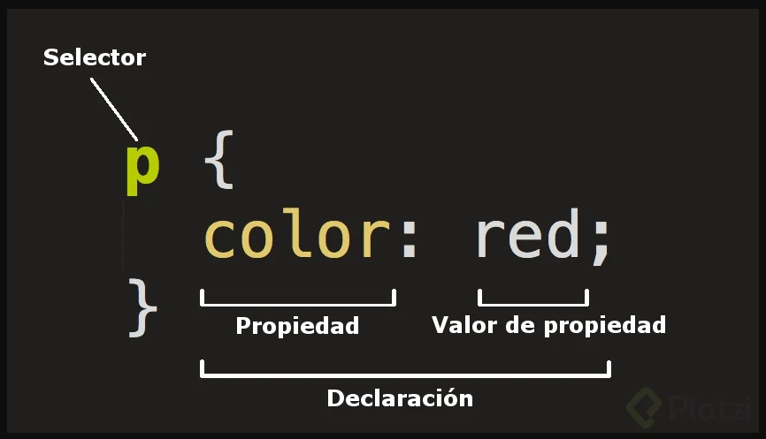
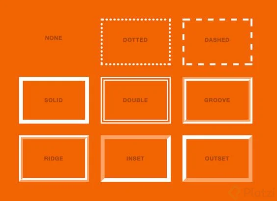
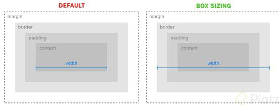
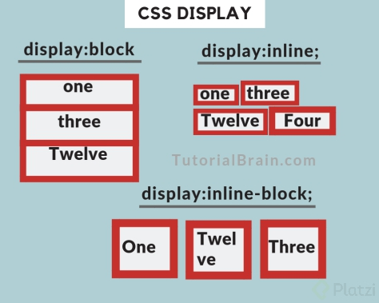
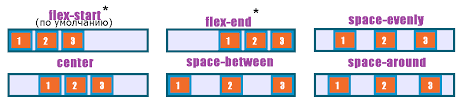

# curso de desarrollo web
## html
 
**h1 a h6: **son etiquetas para indicar títulos con un estilo que destaca del resto.

**article:** es la parte de nuestro contenido que puede vivir por sí mismo. Pueden haber tantos artícle como proyectos o eventos tenga nuestro portafolio.

**p: **define el texto de un párrafo.

**small: **aplica una apariencia de texto reducido en tamaño.

**strong:** aplica al texto un formato de negritas.

**a: **corresponde a un ancla o enlace a una url interna o externa del documento.

    target="_blank": Este me ayuda abrir otra pestaña para visualizar un enlace externo a mi pagina

**img: **con esta etiqueta podemos enlazar imágenes en el documento.
figure: le da un contexto semántico a las imágenes. Este poseé algunos atributos que hacen que la etiqueta funcione. estos son:

    src: específica la ruta de la imagen que será mostrada a través de esta etiqueta. La ruta puede ser absoluta (cunado especifica una dirección exacta, incluyendo el prefijo http(s) ) o relativa (cuando la referencia a la ubicación de la imagen parte de la ubicación del archivo actual).
 
    alt: indica un texto alternativo que será mostrado en lugar de la imagen cuando ésta no pueda ser mostrada.

    width: ancho de la imagen en pixeles.
    
    

    height: alto de la imagen en pixeles.
#css

##Estrucura css

#### tipos de selectores

##### selector de etiqueta

##### selector descendiente

##### selector de clase

##### selector por ID

##Unidades de medida y colores
Hay varias unidades de medida con las que se puede trabajar en CSS: %, em, rem, px, pt, fr, vw, vh

##Propiedades para los textos

    font-family: define el tipo de fuente aplicado al texto.

    color: define el colore del texto.

    line-height: define la altura desde la base del texto hasta la base de la siguiente línea de texto.

    font-size: define el tamaño del texto, admite cualquiera de las unidades de medida disponibles.

    letter-spacing: define el espaciado entre las letras del texto.

    font-weight: define el ““peso”” de la letra, negrita, normal, light y normalmente se indica en múltiplos de 100 o usando keywords.

    text-decoration: define el decorado del texto como subrayado, tachado, con subrayado superior, etc.

    text-transform: permite transformar el estado de mayúsculas / minúsculas en el texto, usando uppercase para mayúsculas sostenidas, lowercase para minúsculas sostenidas, etc.

##propiedades para backgrounds
    background: con la que se puede indicar un color, o usada de manera extendida, puede incluir color de fondo, url de la imagen, posición y modo de repetición de la imagen.
    
    background-image: contiene la url que se usará como fondo del elemento.
    
    background-color: indica el color de fondo, se puede usar en combinación con la imagen.
    
    background-size: se puede indicar en valores de alto y ancho o en alguna de las palabras claves permitidas: cover o contain.
    
    background-position: indica la posición de la imagen dentro del elemento, puede indicarse en unidades o en palabras claves como center, left, top y right o utilizando Z y Y para así asignarles un valor fijo.
    
    background-repeat: indica el método de repetición de la imagen de fondo, puede ser: repeat, repeat-x, repeat-y o no-repeat.
## tipos de bordes 

 

##modelo de caja

El modelo de caja es un concepto teórico de css que representa a cada elemento html en base sus propiedades de: margin, border, padding y dimensiones (alto y ancho).

para que nuestra caja conserve el tamaño fijo que le asignamos se coloca la propiedad 

    box-sizing: border-box;
    
 
 
 
##Display

Display es la propiedad de css que indica cómo debe ser mostrado un elemento html. 
 
 Los valores más comunes que puede recibir la propiedad display son:

    block: el elemento intenta abarcar todo el ancho posible.
    
    inline: reduce su tamaño exclusivamente hasta lo que abarca su contenido, descartando las propiedades width y height.
    
    inline-block: combina lo mejor de block e inline, ya que respeta las dimensiones indicadas en las propiedades width y height, pero coloca el elemento en línea (al costado) de elementos hermanos que también tengan display: inline o inline-block.
    
    flex: asume algunas propiedades por defecto que favorecen la alineación de los elementos internos.
    
    grid: similar a flex, asume algunas propiedades por defecto organizando los contenidos en filas y columnas.
    
    none: oculta el elemento.
    
    
Ejemplo de como se veria este en pantalla:
 

##Propiedades de flexbox

Display: flex; es una apropiedad que se le aplica al padre  pero afecta a los hijos. Por defecto, los elementos internos quedan alineados unos seguidos de los otros. El comportamiento del modelo de caja de estos elementos hijos también se ha modificado, ya que pierden el efecto de su propiedad margin. ejm:

     

        

        

        

 
      

      
en esta ocasión los divs con clase box son lo que van a ser afectados y quedaran alineados 

hay propiedades  que aportan mayor flexibilidad a su comportamiento, como lo son:

##propiedades de flex

    flex-shrink: 0;esta se le aplica a los hijos y este permite que el modelo de caja funcione pero  genera un scroll horizontal si los hijos ocupan mas del ancho disponible de la pantalla. recibe valores de **0 a 1**
    
    flex-wrap: ; este se le aplica al padre, este permite el modelo de caja y si los hijos oupan mas del ancho disponible este los coloca por debajo
    
##Justify-content    
a propiedad de css que nos permite definir la forma en que se alinearán o distribuirán los hijos de un elemento al que se le ha asignado un display flex es: justify-content (de manera horizontal).

    flex-start: para alinear todos los elementos hacia el inicio del espacio disponible.
    
    flex-end: para alinear todos los elementos hacia el final, a la derecha.
    
    center: para alinear todos los elementos al centro del espacio disponible.
    
    space-between: para distribuir los elementos con un espacio proporcional e igual entre ellos.
    
    space-evenly: para distribuir los elementos con un espacio proporcional e igual entre ellos (incluyendo el primer y último elementos con respecto a los extremos del espacio disponible).
    
    space-around: similar a space-evenly pero tanto en el primero como en el último elemento, el espacio hacia los extremos es la mitad del espacio usado entre los elementos.
    
así se verian estos en pantalla 
 

##Align-items
Similar a como sucede con **justify-content**, es posible alinear y distribuir los elementos internos en el espacio vertical disponible usando la propiedad **align-items**, que puede tomar también los valores de: **flex-start, flex-end y center**.

Algo que es muy importante y se debe tener en cuenta a la hora de usar **align-items y justify-content** es que dependiendo de la propiedad **flex-direction** que se haya definido, el efecto de ambos se invierte, no en cuanto a sus elementos internos, sino en cuanto a si se debe usar uno u otro de manera vertical u horizontal.

IMPORTANTE: Cuando la propiedad flex-direction se ha definido como column, la propiedad justify-content ya no va a aplicar sobre la alineación horizontal, sino sobre la vertical. Y align-items ya no aplicaría sobre la alineación vertical sino la horizontal. Se intercambian sus efectos.

Para centrar completamente los elementos internos de manera vertical y horizontal en su elemento padre, debemos usar el valor center en ambas propiedades.

    aling-self : me permite cambiar la posición de solo un hijo a donde este quiera, es decir si los todos los hijos estan alineados al centro y se le aplica el aling-self a uno de ellos este puede cambiar su posición sin afectar a sus hermanos.

    order

    flex-flow: esta propiedad nos ayuda a utilar flex-direction y flex-warp en una sola linea
    
##Algunas propiedades
    object-fit: se utiliza para especificar cómo se debe cambiar el tamaño de un  o <video> para que se ajuste a su contenedor.
Esta propiedad le dice al contenido que llene el contenedor de varias maneras; como "preservar esa relación de aspecto" o "estirar y ocupar tanto espacio como sea posible"

    overflow: La propiedad especifica qué debería suceder si el contenido desborda el cuadro de un elemento.
Esta propiedad especifica si se debe recortar el contenido o agregar barras de desplazamiento cuando el contenido de un elemento es demasiado grande para caber en un área específica.
    
        
